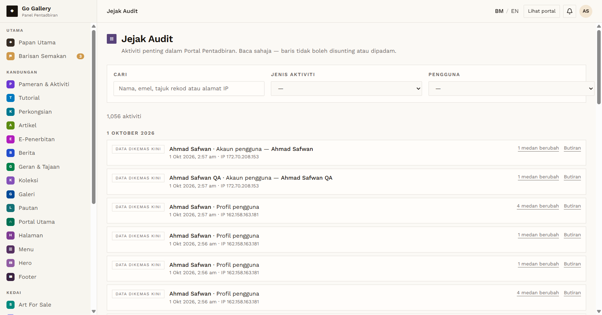
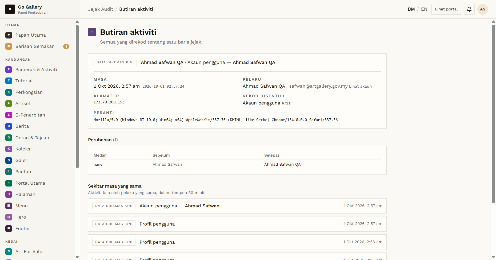

# PRF-17 — Profile updates recorded in the audit trail

- **Module:** Profil Pengguna (update profile)
- **Target:** https://martp.nizamjensani.digital/ · `/dashboard/profile` (Profil Saya) · `/settings/profile` (tetapan akaun)
- **Date:** 2026-10-01 · **Tool:** playwright-cli (headed) · **Role:** Admin
- **Priority:** P1
- **Status:** **PASS (observations)**

## Preconditions
PRF-02 to PRF-16 done.

## Steps
1. Open Jejak Audit (`/dashboard/audit`), search `QA`.
2. Open "Butiran" on several rows.

## Expected result
Each profile/account change is logged with actor, time and changed fields.

## Actual result
Rows such as "Data dikemas kini · QA Test Galeri · Profil pengguna · 6 medan berubah" and "Akaun pengguna — Ahmad Safwan QA · 1 medan berubah". "Butiran" shows time, actor, IP, device, record (e.g. "Profil pengguna #815") and a before/after table per field (e.g. `city  Shah Alam → (kosong)`; `name  Ahmad … → …`). The page says rows cannot be edited or deleted.

**Observations:**
1. The "Pengguna" filter lists every past display name as a separate user (e.g. "QA Test Artis Edit", "Ahmad Safwan QA" and the temporary HTML name), even after the name was changed back.
2. One browser session was logged with three different IPs within minutes (104.23.175.87, 162.158.163.181, 172.70.208.153). This suggests the log stores a proxy/CDN address, not the visitor's IP. It needs checking by the team; not verified from the outside.

## Evidence
 
