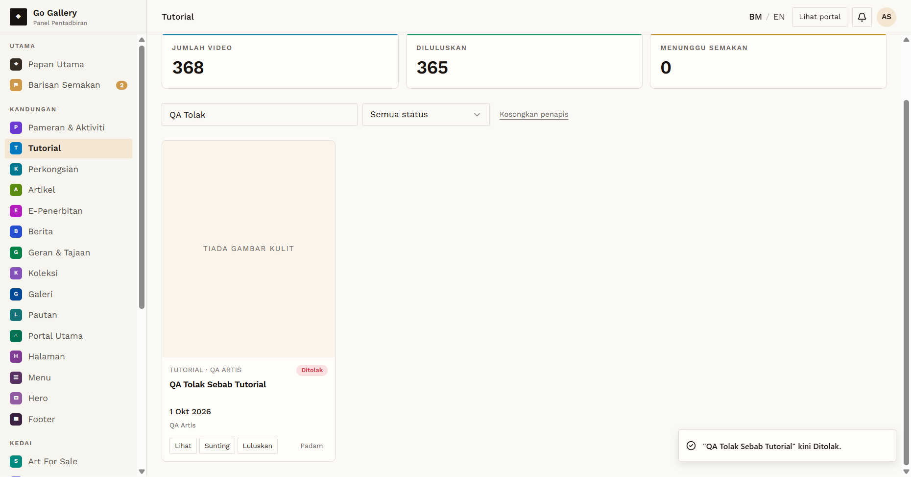
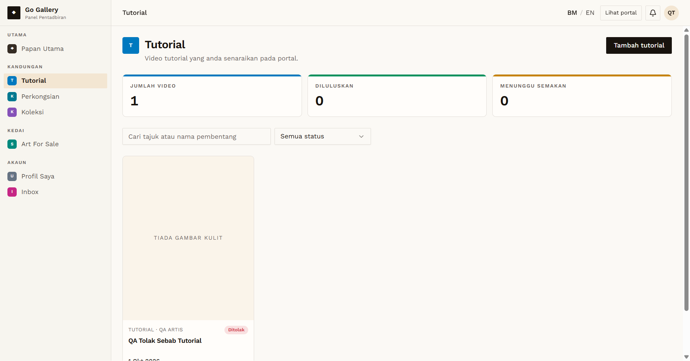
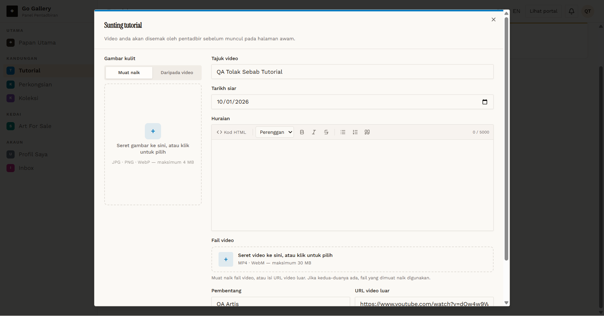
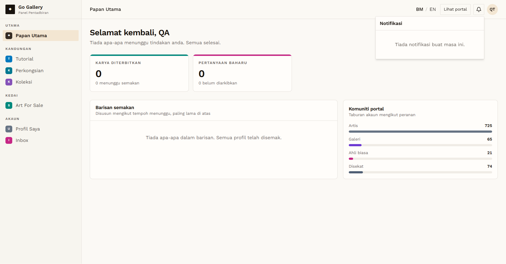

# RJR-01 — Content rejection (Tutorial): is a reason asked for and shown to the artist?

- **Module:** Approval flow (Tutorial used as the sample for the artist content modules)
- **Target:** https://martp.nizamjensani.digital/ · `/dashboard/tutorials`
- **Date:** 2026-10-02 · **Tool:** playwright-cli (headed) · **Roles:** Artist QA, Admin
- **Priority:** P1
- **Status:** **FAIL (gap, needs product decision)**

## Preconditions
Artist QA created `QA Tolak Sebab Tutorial` (status 'Menunggu semakan').

## Steps
1. Admin opens Tutorial, clicks **Tolak** on the QA item.
2. Artist logs in and checks the Tutorial list, the item's Sunting dialog, the dashboard home, Inbox and the Notifikasi bell.
3. Check the Mailinator public inbox of the artist.

## Expected result
Admin can give a reason; the artist can see why the item was declined.

## Actual result
- Admin: Tolak acts **immediately** — no dialog, no reason field, no confirmation. Toast: '"QA Tolak Sebab Tutorial" kini Ditolak.'
- Artist: list card shows the badge **'Ditolak'** only. The edit dialog has only the standard form (no note). Dashboard home says 'Tiada apa-apa menunggu tindakan anda'. Inbox is empty. Notifikasi: 'Tiada notifikasi buat masa ini.' Mailinator inbox: empty.
- So the artist is told nothing about why the item was declined or what to fix.
- Earlier runs show the same for Perkongsian, Koleksi, Art For Sale, Artikel, E-Penerbitan, Berita, Pameran, Perkhidmatan and Cenderahati (Tolak is instant, no reason); see the module FAILURES files. Those were not re-run today.

## Evidence
   
