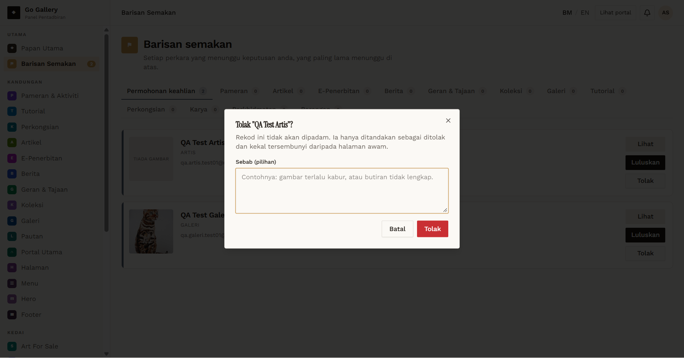
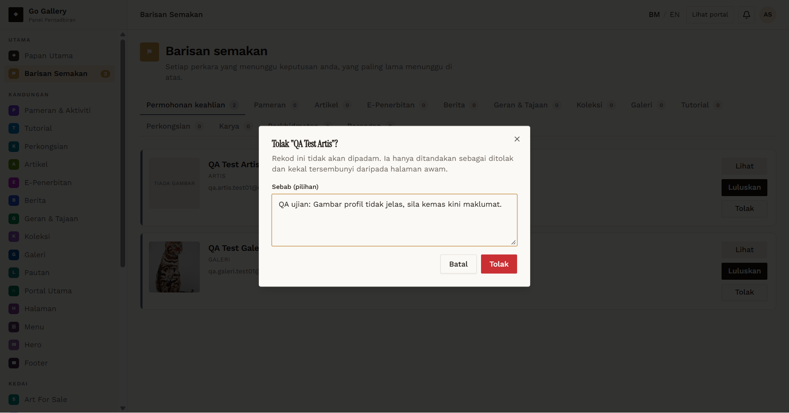
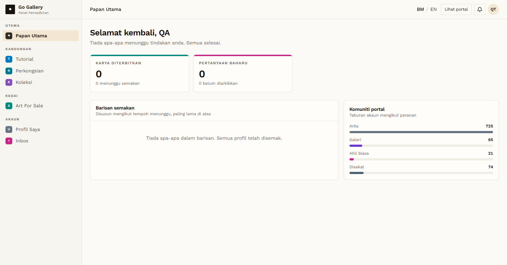
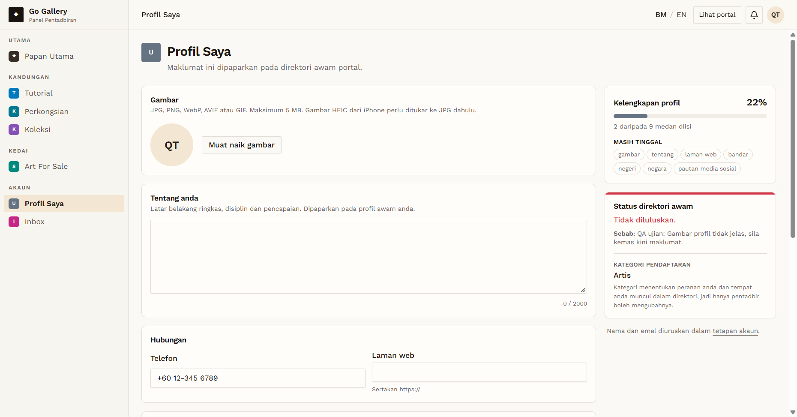

# RJR-02 — Membership (profile) rejection with a reason

- **Module:** Barisan Semakan → Permohonan keahlian
- **Target:** https://martp.nizamjensani.digital/ · `/dashboard/review-queue`, `/dashboard/profile`
- **Date:** 2026-10-02 · **Tool:** playwright-cli (headed) · **Roles:** Admin, Artist QA (`QA Test Artis`)
- **Priority:** P1
- **Status:** **PASS (observation: reason is hard to find, no notification)**

## Preconditions
`QA Test Artis` was waiting in Permohonan keahlian (6 days).

## Steps
1. Admin clicks **Tolak** on `QA Test Artis`; read the dialog.
2. Enter 'QA ujian: Gambar profil tidak jelas, sila kemas kini maklumat.' and confirm.
3. Log in as the artist; check the login result, dashboard home, Notifikasi bell and Profil Saya.

## Expected result
Admin can enter a reason; the applicant can read it.

## Actual result
- Dialog: 'Tolak "QA Test Artis"? Rekod ini tidak akan dipadam… kekal tersembunyi daripada halaman awam.' with an optional field **'Sebab (pilihan)'**. Toast: '"QA Test Artis" telah ditolak.' and the queue count drops from 2 to 1.
- Artist can still log in. Dashboard home shows 'Tiada apa-apa menunggu tindakan anda… Semua profil telah disemak' — no mention of the rejection. Notifikasi: 'Tiada notifikasi buat masa ini.'
- **Profil Saya**, at the very bottom under 'Status direktori awam': **'Tidak diluluskan. Sebab: QA ujian: Gambar profil tidak jelas, sila kemas kini maklumat.'** So the reason IS shown, but only there.
- Observations: the reason is optional; with no reason the artist would only see 'Tidak diluluskan'. No login toast, home banner, bell notification or email points the artist to the reason (Mailinator inbox empty).

## Evidence
   
