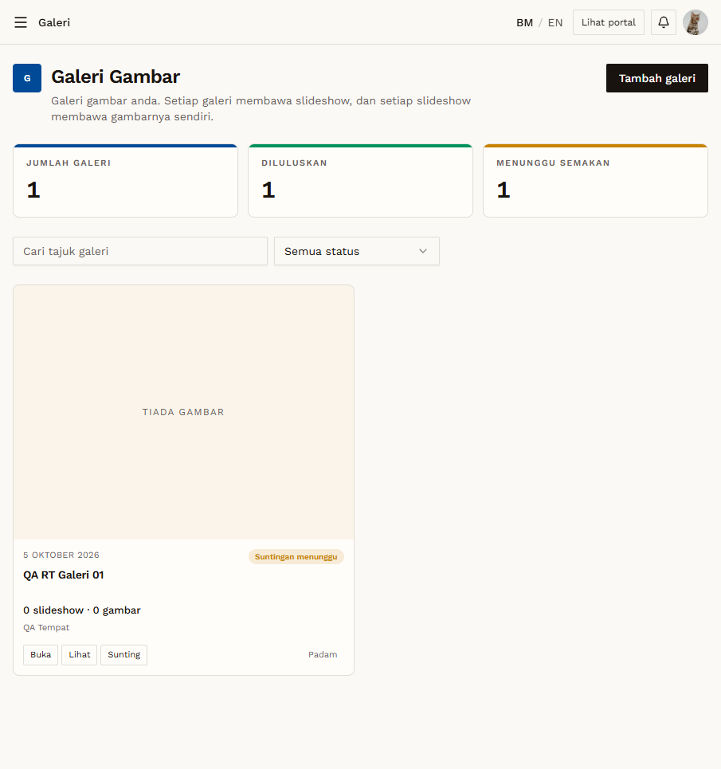

# RT-GAL-09 — Retest: Galeri: edit after approval

- **Original test:** [GAL-09](../galeri/GAL-09-edit-approved-bypass.md) (was **FAIL**)
- **Target:** https://martp.nizamjensani.digital/
- **Date:** 2026-10-01 · **Tool:** playwright-cli (headed) · **Role:** Galeri (QA), Admin
- **Status:** **PASS (fixed)**

## Steps
1. Owner creates a new QA item (titles `QA RT …`); admin approves it with Luluskan.
2. Anonymous visitor checks the public page: item visible.
3. Owner opens Sunting, changes the title to `… (Edit selepas lulus)` (Art For Sale also price 1500 → 9999), saves.
4. Check the owner dashboard card and counters, then the public page as an anonymous visitor.
5. Admin checks the card actions and Barisan Semakan; deletes the QA items at the end.

## Expected result
The change waits for admin review; the approved version stays public.

## Actual result
The edit form now says **"Perubahan anda akan disemak oleh pentadbir. Versi semasa kekal dipaparkan kepada umum sehingga diluluskan."** Saving gives the toast **"Suntingan "…" dihantar untuk semakan. Versi semasa kekal dipaparkan sehingga diluluskan."** The card changes from "Diluluskan" to **"Suntingan menunggu"**, still shows the old title, and the counters show DILULUSKAN 1 and MENUNGGU SEMAKAN 1. The anonymous public page still shows the **old** title. Admin sees "Luluskan suntingan" / "Tolak suntingan" on the card, and Barisan Semakan counts the edit under Galeri.

Galeri wording differs slightly: "Perubahan anda disimpan sebagai draf suntingan…" and the toast "Suntingan … disimpan sebagai draf dan dihantar untuk semakan." Slideshow and image edits were not retested.

## Evidence

