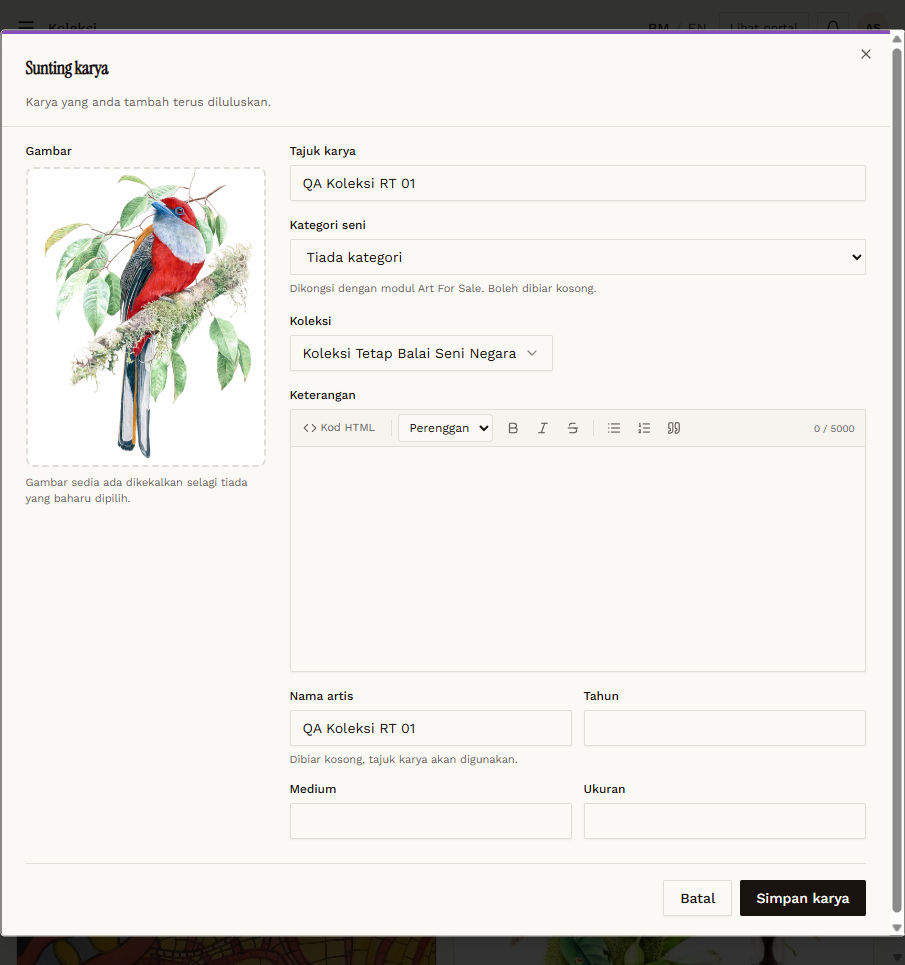
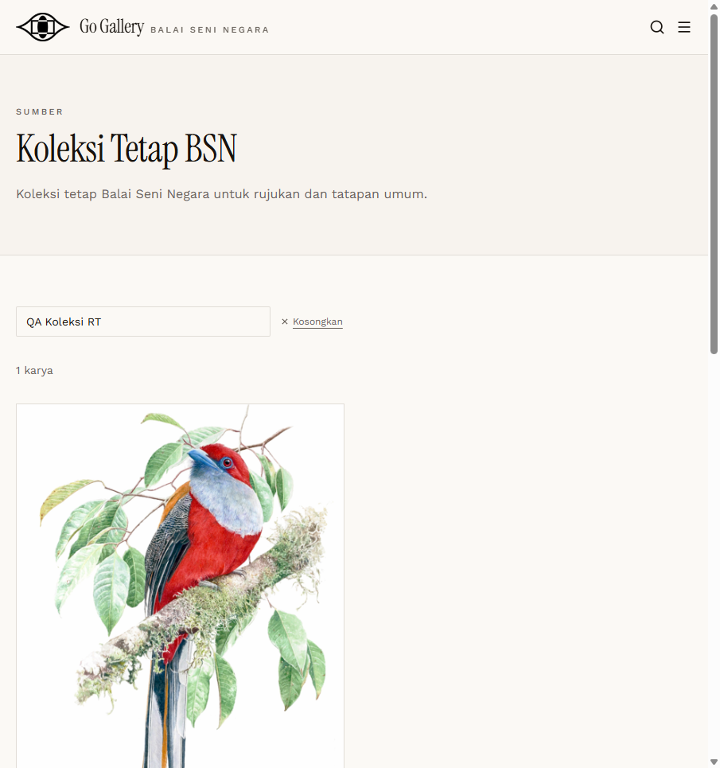

# RT-KOL-09 — Retest: Koleksi: change type on edit

- **Original test:** [KOL-09](../koleksi/KOL-09-edit-koleksi-type.md) (was **FAIL**)
- **Target:** https://martp.nizamjensani.digital/
- **Date:** 2026-10-01 · **Tool:** playwright-cli (headed) · **Role:** Admin
- **Status:** **PASS (fixed)**

## Steps
1. Admin creates `QA Koleksi RT 01` (default Karya artis).
2. Sunting → Koleksi → "Koleksi Tetap Balai Seni Negara" → Simpan karya; reload; reopen Sunting.
3. Search `/resources/nag-collection`.
4. Change it back to Karya artis; delete.

## Expected result
Type changes and the item moves between the counters and public lists.

## Actual result
Toast "…telah dikemas kini."; card shows "KOLEKSI TETAP BALAI SENI NEGARA"; counter KOLEKSI TETAP 99 → **100**; reopening Sunting shows the new value; listed on the public Koleksi Tetap page. Changing it back gave KOLEKSI TETAP 99 and KARYA ARTIS +1. After delete the counters are back to 2,565 / 99 / 2,466.

## Evidence
  
