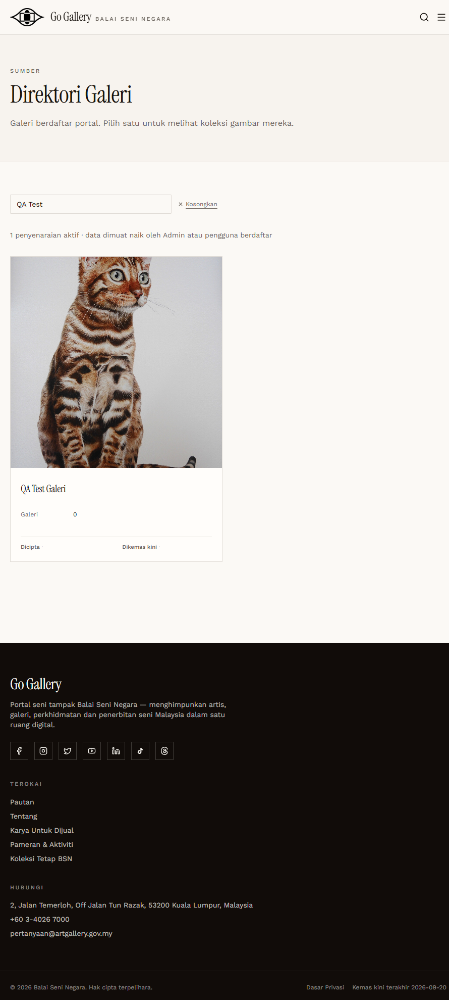
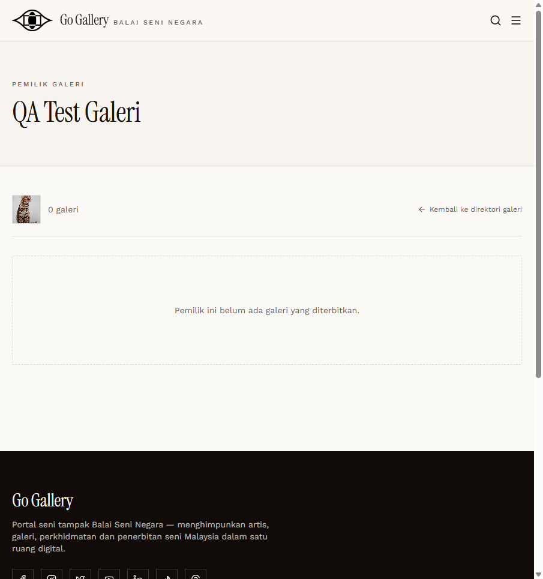

# RT-PND-08 — Retest: Unapproved Galeri in the public directory

- **Original test:** [PND-08](../pending-accounts/PND-08-galeri-public-before-approval.md) (was **FAIL**)
- **Target:** https://martp.nizamjensani.digital/
- **Date:** 2026-10-01 · **Tool:** playwright-cli (headed) · **Role:** Anonymous visitor
- **Status:** **FAIL (still open)**

## Steps
1. Anonymous: `/resources/galleries?search=QA Test`.
2. Open `/resources/galleries/815-qa-test-galeri`.
3. Compare `/resources/artists?search=QA Test`.

## Expected result
Not listed until the membership is approved, like artists.

## Actual result
Still listed: "1 penyenaraian aktif · QA Test Galeri"; profile page 200 with name and photo. The account is still pending (its own profile panel says "Profil anda belum dipaparkan"). The pending artist is correctly hidden ("Tiada artis sepadan…").

## Evidence
 
