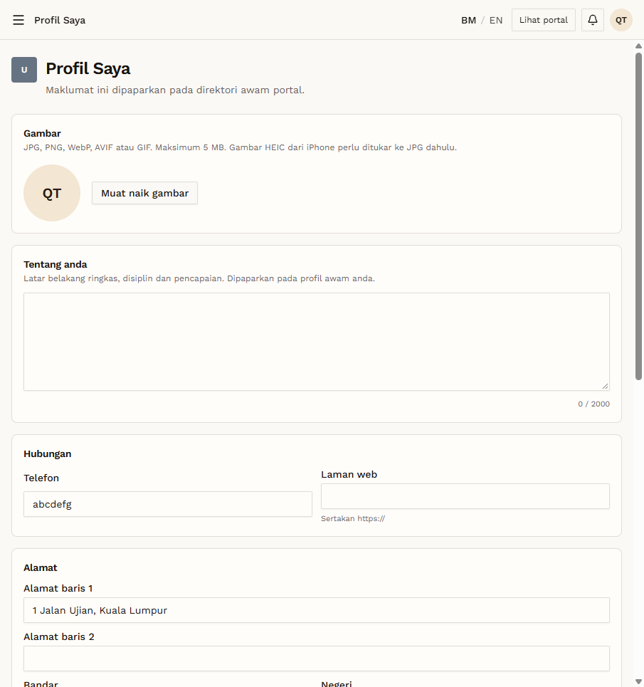
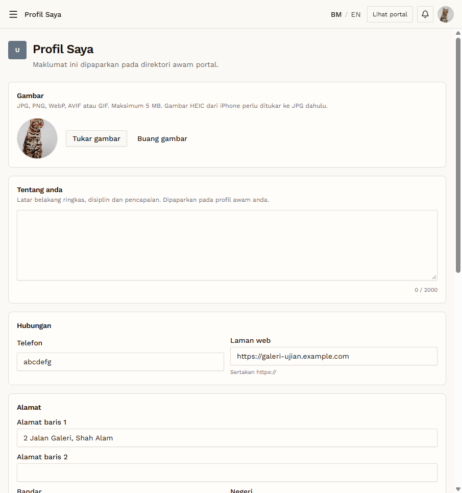
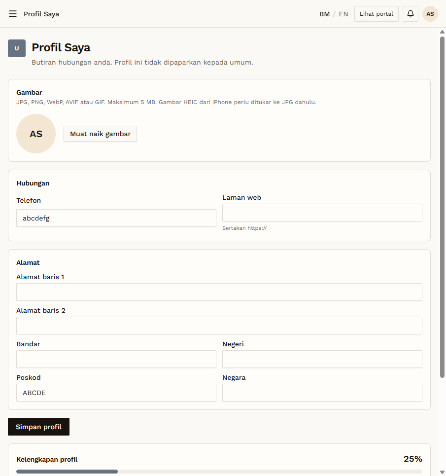

# RT-PRF-04 — Retest: Profile: phone and postcode format

- **Original test:** [PRF-04](../profil/PRF-04-phone-postcode-format.md) (was **FAIL**)
- **Target:** https://martp.nizamjensani.digital/
- **Date:** 2026-10-01 · **Tool:** playwright-cli (headed) · **Role:** Artist, Galeri, Admin
- **Status:** **FAIL (still open, all 3 roles)**

## Steps
1. Profil Saya → Telefon `abcdefg` → save → reload.
2. Poskod `ABCDE` → save → reload.
3. Repeat for each role; restore values.

## Expected result
Format error.

## Actual result
Saved for **all three roles** ("Profil anda telah dikemas kini.", kept after reload). Values were restored afterwards. This is now confirmed on the Galeri and Admin forms too.

## Evidence
  
