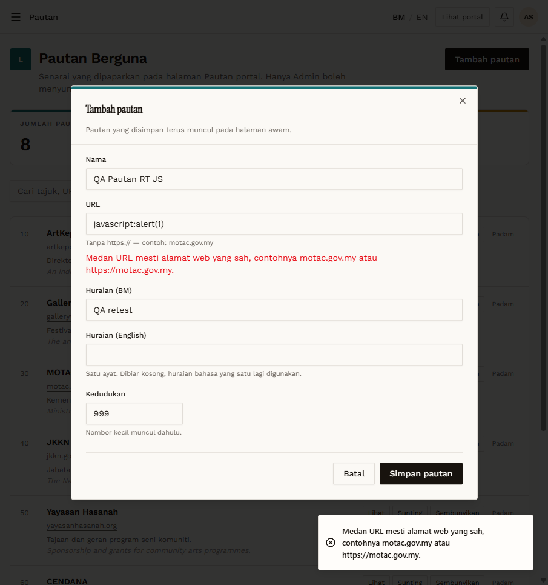

# RT-PTN-05 — Retest: Pautan: URL validation

- **Original test:** [PTN-05](../pautan/PTN-05-url-validation.md) (was **FAIL**)
- **Target:** https://martp.nizamjensani.digital/
- **Date:** 2026-10-01 · **Tool:** playwright-cli (headed) · **Role:** Admin
- **Status:** **PASS (fixed)**

## Steps
1. Tambah pautan with URL `javascript:alert(1)`; save.
2. Repeat with `not a url with spaces`.
3. Create a valid link `qa-rt.example.com`; check `/links`; delete it.

## Expected result
Invalid URLs rejected; valid ones still saved.

## Actual result
Both invalid URLs were rejected: "Medan URL mesti alamat web yang sah, contohnya motac.gov.my atau https://motac.gov.my." The dialog stayed open and the total stayed at 8. The valid link saved and opened `https://qa-rt.example.com/` publicly. Delete asked for confirmation; the total is back to 8.

## Evidence
 
