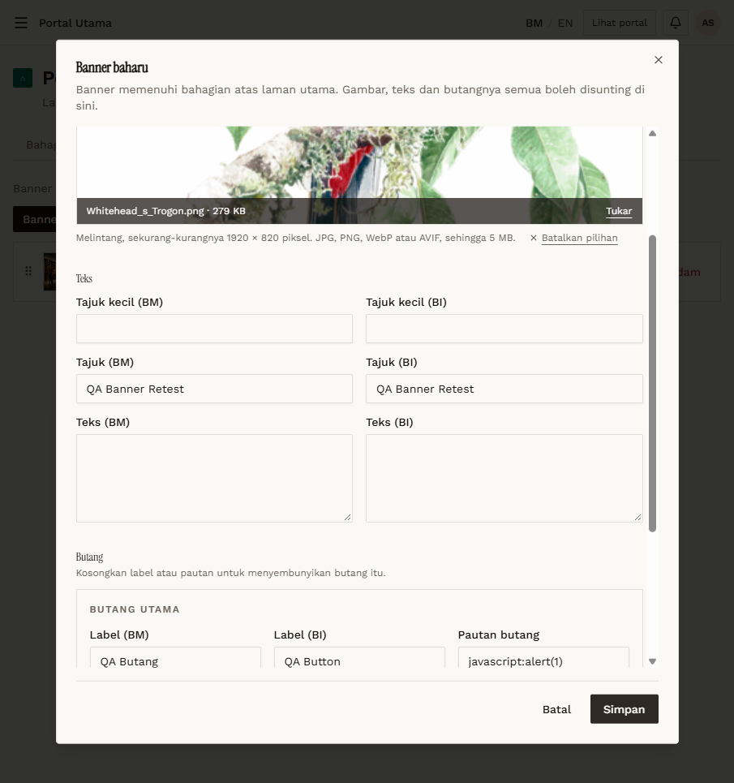

# RT-PTU-08 — Retest: Banner: button link validation

- **Original test:** [PTU-08](../portal-utama/PTU-08-banner-link-validation.md) (was **FAIL**)
- **Target:** https://martp.nizamjensani.digital/
- **Date:** 2026-10-01 · **Tool:** playwright-cli (headed) · **Role:** Admin
- **Status:** **PASS (fixed)**

## Steps
1. Banner baharu: image, title, primary button label, Pautan butang `javascript:alert(1)`; Simpan.
2. Retry with `JaVaScRiPt:alert(1)`.
3. Save with `/collection`.

## Expected result
Script links rejected with a message.

## Actual result
Both were rejected: "Medan pautan butang utama mesti laluan dalam portal seperti /collection, atau alamat penuh seperti https://motac.gov.my." `/collection` saved ("Banner QA Banner Retest ditambah.").

## Evidence

