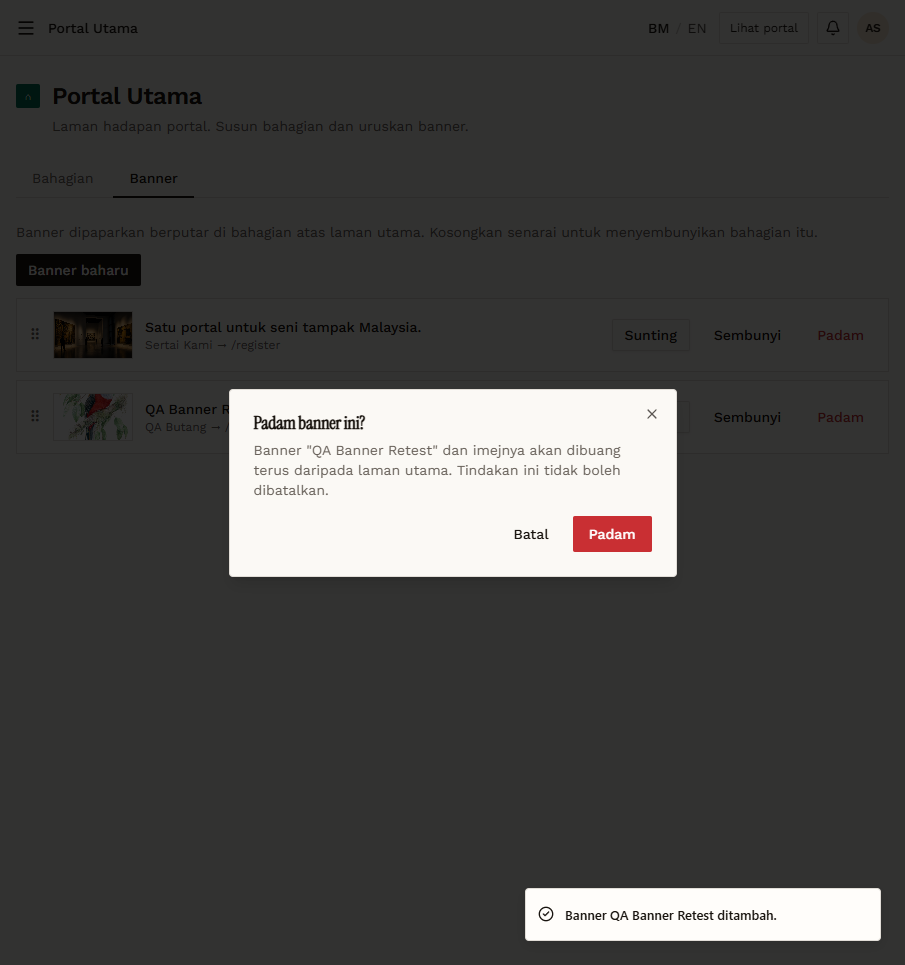

# RT-PTU-11 — Retest: Banner: delete confirmation

- **Original test:** [PTU-11](../portal-utama/PTU-11-banner-delete.md) (was **FAIL**)
- **Target:** https://martp.nizamjensani.digital/
- **Date:** 2026-10-01 · **Tool:** playwright-cli (headed) · **Role:** Admin
- **Status:** **PASS (fixed)**

## Steps
1. Click Padam on the QA banner.
2. Batal.
3. Padam again and confirm.

## Expected result
Confirmation first; Batal keeps the banner.

## Actual result
Dialog "Padam banner ini? Banner "QA Banner Retest" dan imejnya akan dibuang terus daripada laman utama. Tindakan ini tidak boleh dibatalkan." with Batal / Padam. Batal kept it; confirming deleted it ("…dipadam."). Only the original live banner remains.

## Evidence

