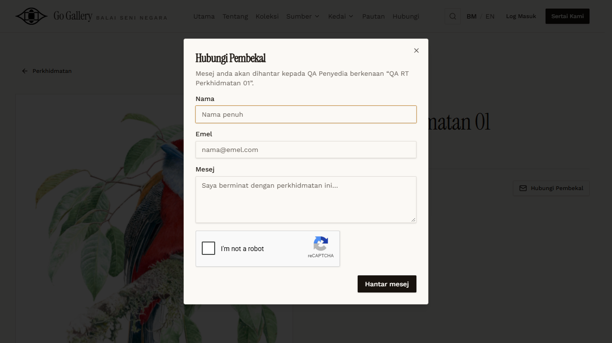

# RT-SVC-05 — Retest: Perkhidmatan: contact provider

- **Original test:** [SVC-05](../perkhidmatan/SVC-05-contact-provider.md) (was **BLOCKED**)
- **Target:** https://martp.nizamjensani.digital/
- **Date:** 2026-10-01 · **Tool:** playwright-cli (headed) · **Role:** Admin, anonymous visitor
- **Status:** **BLOCKED (reCAPTCHA)**

## Steps
1. The public list had 0 listings, so admin created `QA RT Perkhidmatan 01` (approved directly).
2. Anonymous: open it, click Hubungi Pembekal; do not send.
3. Admin deletes it.

## Expected result
Message can be sent to the provider.

## Actual result
Same form with reCAPTCHA. Not sent. QA listing deleted (count back to 0).

## Evidence

